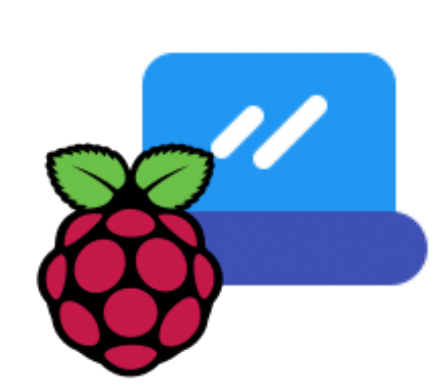

<div align="center">
<h1>RASP2PC</h1>

<br>

A program based on socket protocol that uses a Raspberry Pi with touchscreen to control a computer via shortcuts

</div>

## Index

- [Why?](#why?)
- [How it Works](#how-it-works)
- [Screenshots](#screenshots)
- [Security](#security)
- [Installation](#installation)
- [Configuration](#configuration)
- [Usage](#usage)
  - [PC Component](#pc-component)
  - [RASP Component](#rasp-component)
  - [RASPBIG Component](#raspbig-component)
  - [RASPCLI Component](#raspcli-component)
- [Default Shortcuts](#default-shortcuts)
  - [System Fuctions](#system-functions)
  - [Programs / Commands](#programs--commands)
  - [Keyboard shortcuts](#keyboard-shortcuts)
- [Enhancements](#enhancements)
- [Technologies](#technologies)
- [Compatibility](#compatibility)
  - [Linux](#linux)
  - [Windows](#windows)
  - [Mac Os](#mac-os)
- [ToDo](#todo)
- [Known Issues](#known-issues)
- [License](#license)

## Why?


Because using the keyboard and mouse, especially while you're doing something else, like video calling, can be really unconfortable. And also, control a computer with a touch screen seems really *c o o l*.

## How it Works


The project is composed of 3 parts, called "components".

* [**PC Component**](https://github.com/seepiol/Rasp2Pc/blob/master/pc.py), which runs on the main computer (with linux operating system) and which consists of a socket server
* [**RASP Component**](https://github.com/seepiol/Rasp2Pc/blob/master/rasp.py), which is made to run on a [Raspberry Pi](https://www.raspberrypi.org/) with a touchscreen and it's the client
* [**RASPCLI Component**](https://github.com/seepiol/Rasp2Pc/blob/master/raspcli.py), an alternative to RASP components, for devices that do not have a graphical environment (for example [**Termux**](https://termux.com/) on android)

The RASP (or raspcli) component send an encrypted index to the PC, which corresponds to a certain function. The PC gets the index, run the command and eventually returns the result or the status of the command.

It also exist the [**RASPBIG Component**](https://github.com/seepiol/Rasp2Pc/blob/master/raspbig.py), which is equal to rasp but the GUI is optimized for high resolution touchscreen monitors (>800x480)

## Screenshots

**[PC Component](https://user-images.githubusercontent.com/60071372/82824947-90408d80-9eaa-11ea-9457-c172377f6858.png)**

**[RASP Component](https://user-images.githubusercontent.com/60071372/82824949-90d92400-9eaa-11ea-8d4e-b58012138afc.png)**

**[RASPCLI Component](https://user-images.githubusercontent.com/60071372/82824929-8880e900-9eaa-11ea-8521-fa99afb0eb06.png)**

**[RASPBIG Component](https://user-images.githubusercontent.com/60071372/86596035-e4568b80-bf99-11ea-9348-0a7fbfae2479.png)**

The user interface may vary depending on the QT settings on your system

## Security

The packets are encrypted before sending with
[AES-128](https://en.wikipedia.org/wiki/Advanced_Encryption_Standard)  encryption algorithm. By
default is hardcoded a 128 bit key and a 128 bit [initialization
vector](https://en.wikipedia.org/wiki/Initialization_vector). Please generate a new key and
insert it into the code [on rasp
component](https://gitlab.com/seepiol/Rasp2Pc/blob/master/rasp.py#L404), [raspBig
component](https://gitlab.com/seepiol/Rasp2Pc/blob/master/raspbig.py#L402), [raspCli
component](https://gitlab.com/seepiol/Rasp2Pc/blob/master/raspcli.py#L40) and [on pc
component](https://gitlab.com/seepiol/Rasp2Pc/blob/master/pc.py#L208)

The library used for the encryption is [PyCryptoDome](https://github.com/Legrandin/pycryptodome)

## Installation
1) Clone this repository:

    ``git clone https://gitlab.com/seepiol/rasp2pc.git``
    
2) Move into the folder

    `` cd rasp2pc``

3) Install the dependencies

    ``python3 -m pip install --user -r requirements.txt``

### How to install PyQt5 on Raspbian (now Raspberry Pi OS)

``sudo apt update && sudo apt-get install qt5-default pyqt5-dev pyqt5-dev-tools``

## Configuration
Make sure that all the dependencies are installed by typing `pip install -r requirements.txt`.
On debian-based distros, install PyQt5 by typing in a terminal window `sudo apt install python3-pyqt5`.

First of all, you need to make sure that the shortcuts file is correct for your pc's system and good for you (more [here](#default-shortcuts))
You have to add the ip address of the PC on the rasp.conf configuration file.
For example, if the ip address of the PC is 192.168.1.20, and the socket is listening to the port 10000 (as default), rasp.conf will be:

```
192.168.1.20, 10000
```

By default is used the port 10000, and the PC accept connection for every IP address. See [usage](#usage) to learn how to bind the server on different address/port.

For security reasons, generate a cryptographic key and insert it into the code (see [security](#security)

## Usage

### PC Component

> Make sure to add a firewall exception on port 10000

```
$ cd rasp2pc
$ python3 pc.py
```

Will accept any address on port 10000.
At the moment of the connection you can accept or deny the connection by typing `yes` or `no`

**Yes**

```
('127.0.0.1', 55230) is trying to connect to this pc. 
('127.0.0.1', 55230) seems to be a RASP component
Do you want to accept this connection? <Y es/N o>: y
Connection with ('127.0.0.1', 55230) accepted
```

**No**

```
('127.0.0.1', 55232) is trying to connect to this pc. 
('127.0.0.1', 55232) seems to be a RASP component
Do you want to accept this connection? <Y es/N o>: n
Connection Denied 
```

PC component also support CLI Arguments:

```
$ python pc.py -h
usage: pc.py [-h] [--host HOST] [--port PORT]

Rasp2Pc PC Component

optional arguments:
  -h, --help   show this help message and exit
  --host HOST  the addess the where socket server will be listening (default=everyone)
  --port PORT  the port where the server will be listening (default=10000)
```

If you want to bind the server on a different address or port, you can specify that using

```
$ python3 pc.py --host 192.168.1.20 --port 20222
```

> ⚠️ The ports below 1024 are called "privileged". Theoretically, you can call pc.py with superuser privileges and use there ports, but this is disabled for security reasons.

### RASP Component

Just type

```
$ cd rasp2pc
$ python3 rasp.py
```

in this way, RASP will follow the instructions contained in the [rasp.conf file](#configuration). if you want to change the settings just once, you can do so from the CLI Arguments

```
$ python rasp.py -h
usage: rasp.py [-h] [--host HOST] [--port PORT]

Rasp2Pc RASP Component

optional arguments:
  -h, --help   show this help message and exit
  --host HOST  the addess of the PC Component (default=)
  --port PORT  the port of the PC Component (default=10000)
```

So, if you want to connect the RASP component to a different PC (Ex. `192.168.1.32`) on a different port (Ex. `3042`), you must type

```
$ python rasp.py --host 192.168.1.32 --port 3042
```

ELI5, the cli arguments will temporarily overwrite `rasp.conf` configuration file

### RaspBig Component

The usage is equal to the RASP Component, but the GUI is bigger and T H I C C, made for high resolution monitor (800x420)

### RaspCli Component

This component is the equal to RASP but without GUI.
It's made for non-GUI systems, For example TERMUX on android phones.

type:

```
python raspcli.py --host <pcipaddress> 
```

## Default Shortcuts

By default, the program has 3 system functions shortcuts, 6 shortcuts for launching programs / commands and 6 keyboard shortcuts.

### System Functions

The system functions are defined in `shortcuts.json`, and the format is `"name":"command"`.

Please note that system function icons must be contained in `icons/` and must have the same name as the key inserted in the shortcuts.json file, followed by the .png extension. For example, if a system action is `"network":"ifconfig wlan0 down"`, in `icons/` there must be an icon called `network.png`

You can download the icons from [material.io](https://material.io/resources/icons/?style=baseline)

```
{
  "system_functions":{
    <------- SEE HERE
  },
  "app":{
    ...
  },
  "keyboard":{
    ...
  }
}
```

| Function     | Command                          |
| ------------ |:--------------------------------:|
| Reboot PC    | `reboot`                         |
| Lock session | `loginctl lock-session`          |
| Mute audio   | `amixer -D pulse sset Master 0%` |

### Programs / Commands

The labels and the commands are defined in [shortcuts.json file](gitlab.com/seepiol/rasp2pc/shortcuts.json), app list.

For the consistency between rasp(s) component and pc the shortcuts file must be identical.

The file format is `"label":"command",`, and each line is contained in the `app` section of `shortcuts.json`.

```
{
  "system_functions":{
    ...
  },
  "app":{
    <------ SEE HERE
  },
  "keyboard":{
    ...
  }
}
```

The default programs shortcuts are:

| Program/Action (label)         | Subprocess Command                       |
| ----------------------- |:----------------------------------------:|
| Mozilla Firefox Browser | `firefox`                                |
| Terminal*          | `gnome-terminal`                                |
| Virtualbox              | `virtualbox`                             |
| File Manager*     | `nautilus`                                |
| VS Codium               | `vscodium`                               |
| App Store*               | `pamac-manager`                          |
| Telegram                | `telegram-desktop`                       |
| Libreoffice Launcher    | `libreoffice`                            |
| Mozilla Thunderbird     | `thunderbird`                            |
| Screen Recording        | `simplescreenrecorder --start-recording` |

The actions marked with an asterisk (*) are system specific. 

### Keyboard shortcuts

The labels and the keyboard shortcut keys are defined in shortcut file.

The format is `label:keys`

```
 { 
   "system_functions":{
     ...
   },
   "app":{
     ...
   },
   "keyboard":{
     <------ SEE HERE
   }
 }
```

Currently shortcuts can only be made up of 1 or 2 keys. You have to follow the list below:

| Key | Syntax |
|:----:|:------:|
| Alt | alt |
| Alt Gr | alt_gr |
| Alt Right | alt_r |
| Alt Left | alt_l |
| Backspace | backspace |
| Caps Lock | caps_lock |
| Command | cmd |
| Command Right | cmd_r |
| Command Left | cmd_l |
| Control | ctrl |
| Control Right | ctrl_r |
| Control Left | ctrl_l |
| Delete | delete |
| Arrow Down | down |
| End | end |
| Enter | enter |
| Esc | esc |
| Function Key 1-20 | f1 |
| Home | home |
| Insert | insert |
| Media Next | media_next |
| Media Play Pause | media_play_pause | 
| Media Previous | media_previous |
| Media Volume Up | media_volume_up |
| Media Volume Down | media_volume_down |
| Media Volume Mute | media_volume_mute |
| Menu | menu |
| Num Lock | num_lock |
| Page Down | page_down |
| Page Up | page_up |
| Pause | pause |
| Media Volume Up | media_volume_up |
| Media Volume Down | media_volume_down |
| Media Volume Mute | media_volume_mute |
| Menu | menu |
| Num Lock | num_lock |
| Page Down | page_down |
| Page Up | page_up |
| Pause | pause |
| Print Screen | print_screen |
| Arrow Right | right |
| Scroll Lock | scroll_lock |
| Shift | shift |
| Shift Right | shift_r |
| Shift Left | shift_l |
| Space | space |
| Tab | tab |
| Arrow Up | up |


The default shortcuts are: 

| Function               | Keys   | Usage       |
| :---------------------- |:------:|:-----------:|
| Undo                   | Ctrl+Z | Everywhere  |
| Copy                   | Ctrl+C | Everywhere  |
| Cut                    | Ctrl+X | Everywhere  |
| Paste                  | Ctrl+V | Everywhere  |
| Mic ON/OFF             | Ctrl+D | Google Meet |
| Webcam ON/OFF          | Ctrl+E | Google Meet |
| Fullscreen             | F11    | Everywhere  |
| Screenshot (spectacle) | PRTSC  | everywhere  |
| Close Window           | Alt+F4 | everywhere  |
| Blank                  | -      | -           |

If you want to know more about keyboard shortcuts, view [PyNput documentation](https://pynput.readthedocs.io/en/latest/keyboard.html).

## Enhancements

### Create .desktop file
If you want to launch rasp2pc components by clicking an icon instead of opening the terminal, follow the instructions below

Remember to replace `<RASP2PC_PATH>` with the path of rasp2pc folder, and `<COMPONENT>` with the component name (`pc`, `rasp`, `raspbig`, `raspcli`)

- Create a file named `rasp2pc-<COMPONENT>.desktop`
(for example, `rasp2pc-rasp.py`)
in `.local/share/applications/`

- Open the .desktop file and paste the code below

```
[Desktop Entry]
Name=Rasp2Pc
GenericName=Rasp2Pc-<COMPONENT> component
Exec=cd <RASP2PC_PATH>/ && python3 <COMPONENT>.py
Icon=<RASP2PC_PATH>/icons/icon.png
Type=Application
Terminal=True
Categories=Utilities;Network;Utility;Remote;Internet;
```

> This procedure is available only on linux distributions


## Technologies

- Python 3
- Socket - communication between pc and raspberry
- Subprocess - execute commands on pc
- [Pynput](https://pypi.org/project/pynput) - emulates keyboard shortcuts
- [PyQt5](https://riverbankcomputing.com/software/pyqt/) - GUI for rasp component
- amixer - mute the pc
- [PyCryptodome](https://pypi.org/project/pycryptodome/) - encrypt packets with AES-128 

## Compatibility

I've succesfully tested all the components on these configs:

* PC and RASP on Manjaro GNU/Linux (Plasma)
* PC and RASP on Manjaro GNU/Linux (GNOME)
* PC and RASP on GNU/LINUX antiX-19
* PC and RASP on Microsoft Windows 10 *
* PC and RASP on WSL Ubuntu
* PC and RASP (including RASPCLI) on Ubuntu 20.04 LTS (GNOME)
* PC and RASP on Arch Linux (i3wm)
* PC and RASP on Fedora 32 (Plasma)
* PC on Arch Linux (Plasma)
* RASP on Raspberry Pi 3B+ Raspbian GNU/Linux 10 (Buster) (now raspberry pi os) & 800x480 5 inch touchscreen monitor
* RASPCLI on Termux (Android 10)


Feel free to test it on your machine and open an issue to let me know if it works.

\* : see [Windows](#windows) for windows configuration

### Linux
I made this on linux, and I've tested on it all of the time. It should work on every distro without problems.

### Windows
To make the PC component compatible with windows, it's enough to customize the shortcuts.json.
The command should be `start <executable filename>`. If the executable is in the path, is enough to insert `start <name>`.  
For example:<br>
```Firefox, start firefox```.

At the moment, the only way to make the system actions work on windows is to change the code.

RASP and RASPBIG components are compatible by default.

### Mac Os
It teorically works (because it uses the bash shell), both pc and rasp, but I haven't tested yet.

## ToDo

- [x] Unify app execution functions
- [x] Unify keyboard shortcuts execution functions
- [x] Unify system actions execution functions
- [ ] Confiration popup when reboot sysfunction
- [x] Shortcuts.json for system actions and keyboard shortcuts
- [ ] Leave applications open after shutting down pc component
- [x] DRY on index sending functions (RASP,RASPBIG)
- [ ] DRY on application startup functions (PC)
- [x] Update RASPCLI
- [ ] Improve error handling
- [ ] Test Mac Os support
- [ ] System Tray Icon and actions (exit, )
- [ ] permit the execution of the rasp component even if the pc is down
- [ ] Rasp Autostart option
- [ ] Pc autostart option
- [ ] simple pc component ui (tkinter?)
- [ ] more actions (with python libs maybe, not just subprocess and keyboard)
- [ ] password instead of just AES
- [ ] OOP implementation (python is weird, maybe in another language)
- [ ] kde plugin

## Known Issues

* If the PC component is turned off (Ctrl+C) with a RASP component still connected, PC will give you `Something went wrong: [Errno 98] Address already in use`. This is a system issue. Close the RASP component and wait 1 minute more or less, and restart the PC component

* If a RASP connects to PC the second time, the first command that will be selected on rasp won't work. That's because when a RASP component reconnects to PC it sends to the socket a weird undecodable string. It's an annoying bug but it solves [this issue](https://gitlab.com/seepiol/Rasp2Pc/issues/8)

## License

GNU General Public License v3.

See [LICENSE](https://gitlab.com/seepiol/Rasp2Pc/blob/master/LICENSE) for more details .

###### Made with 🖤 during COVID-19 Quarantine
